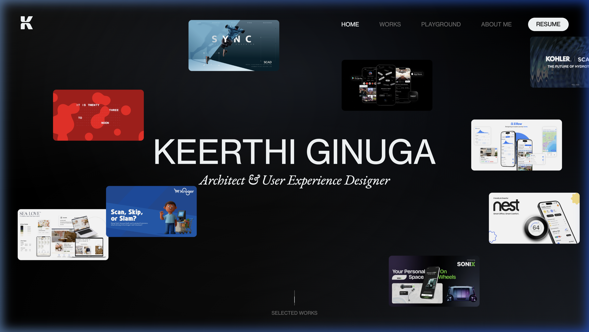

<div align="center">

# Portfolio V2 

[](#features)
[](#features)

A ground-up rebuild of the portfolio platform emphasizing zero-dependency animations, modular architecture, and extreme performance.

[View the Repository Root](../README.md)

</div>

---

<br />

<div align="center">
  
</div>

<br />

## ⚡ Core Philosophy

The primary objective of this **V2 iteration** was to eliminate dependencies on heavy external libraries like GSAP for vanilla projects while matching (or exceeding) the visual fluidity of top-tier Awwwards sites. This rebuild leverages native CSS hardware acceleration, `requestAnimationFrame`, and intersection observers for buttery smooth 60fps scrolling and parallax effects.

---

## 🎯 Locked Plan Requirements

1. **Absolute Responsiveness:** The V2 website is meticulously crafted to be fully responsive across desktop, laptop, tablet, and mobile devices without arbitrary breakpoints.
2. **Quality Gates:** Every section implementation checkpoint underwent rigorous responsiveness validation before sign-off.
3. **Accessibility First (A11Y):** Motion/interaction logic is engineered to gracefully degrade on touch devices and automatically disable when CSS media queries detect `prefers-reduced-motion` is enabled by the user.

---

## 🚀 Key Technical Features

### Vanilla JavaScript Architecture
- Custom, lightweight implementation for **smooth scrolling** and staggered reveal animations.
- Dynamic **unified navigation contrast** (`navContrastState`): calculates pixel-luminance below the transparent navbar header to intelligently flip text from white-to-black or black-to-white, preventing unreadable UI over changing hero images.
- A single unified global **Event Delegator** intercepting link clicks for router-like instant page transitions and loading screens.

### Advanced CSS Execution
- **Variable Font Integration:** Extensive usage of `Inter` for highly flexible font weighting without multiple heavy HTTP requests.
- **Backdrop Filters:** Widespread, performant use of `backdrop-filter: blur()` to replicate high-end native iOS frosted-glass aesthetics. 

---

## ⚛️ React Component Prototype Deliverable

Alongside the vanilla implementation, a modular React + Framer Motion prototype was built:
- File located at: `react-components/ParallaxProjectCard.tsx`
- **Features:** 
    - Background infinite marquee elements
    - 3D perspective mouse-tracking container mapping `(-10deg..10deg)` via framer motion values and springs
    - Layered `preserve-3d` mockups with dynamic `translateZ` depth
    - Automated project state switching upon full `360deg` card rotation

---

## 🛠️ Run & Test Locally

Clone the root repository, navigate to this folder, and serve it via your preferred method.

```bash
# Using Python
python3 -m http.server 9005
```

Navigate to: `http://localhost:9005/portfolio-v2/index.html`

---

<div align="center">
  <sub>Engineered by Keerthi Ginuga. © 2026</sub>
</div>
